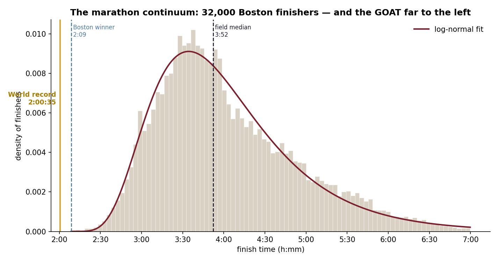

# The Marathon Performance Continuum

**Where does any marathon time fall among real runners — and just how superhuman is the world record?**

> 🌐 **Overview:** https://lyhjeremy.github.io/marathon-performance-continuum/

Fans know a 2-hour marathon is "fast" and a world record is "hard," but rarely in
numbers you can feel. This project models the full distribution of a real marathon
field — **31,842 Boston 2014 finishers** — then places the world record on it and
quantifies the gap, using a fitted body distribution and **Extreme Value Theory**
on the fast tail.

<p align="center">
  
</p>

## What it finds

- **The field is log-normal**, centred on a **3:52 median** (mean 4:03), tailing out
  to 7 hours — the familiar right-skewed shape of a marathon field.
- **The world record (2:00:35) is off the chart.** It is faster than **all 31,842
  finishers — including the winner (2:09)** — and sits **2.4 standard deviations
  below the field mean**. The median finisher is **93% slower** than the WR.
- **The elite edge is *bounded*, not heavy.** A Peaks-Over-Threshold GPD fit on the
  fastest 5% gives a shape parameter **ξ ≈ −0.15 (< 0)** — the tail has a finite
  edge rather than running off indefinitely, consistent with a hard human ceiling.
- **A "you-vs-the-field" lookup**: a 3:00 marathon beats ~93% of this field; 4:00 is
  right at the median; and every level's gap to the WR is tabulated.

## An honest caveat about the data
Boston is a **qualifying** race, so this is the distribution of already-committed,
already-fast marathoners — not the general public. It is the cleanest large, public
marathon field available, and every claim here is about *this* field (stated as
such). A general-population race would shift the whole curve slower and make the
world record look even more extreme.

## Run it
```bash
pip install -r requirements.txt
python fetch_data.py      # Boston 2014 finishers -> data/raw/ (git-ignored)
python analyze.py         # distribution + EVT + lookup -> figures/ + tables/
```

## Files
| Path | What it is |
|---|---|
| `fetch_data.py` | Download & clean the Boston field (runners only, plausible times) |
| `analyze.py` | Log-normal fit, world-record positioning, EVT tail, percentile lookup |
| `figures/` | The continuum, the EVT tail fit, the you-vs-field percentile curve |
| `tables/` | `summary.csv`, `you_vs_goat.csv` |

## Method notes
The world record's exact rarity ("1 in N") is deliberately **not** quoted — that far
into the tail the fitted density is not trustworthy, so the record is described
empirically (faster than everyone; 2.4 SD out) instead. Likewise EVT reports the
robust tail *shape* ξ, not a point estimate of the fastest-possible time, which
Peaks-Over-Threshold cannot pin down reliably.

## License
[MIT](LICENSE) © 2026 Jeremy Lee · finisher data from `llimllib/bostonmarathon`
