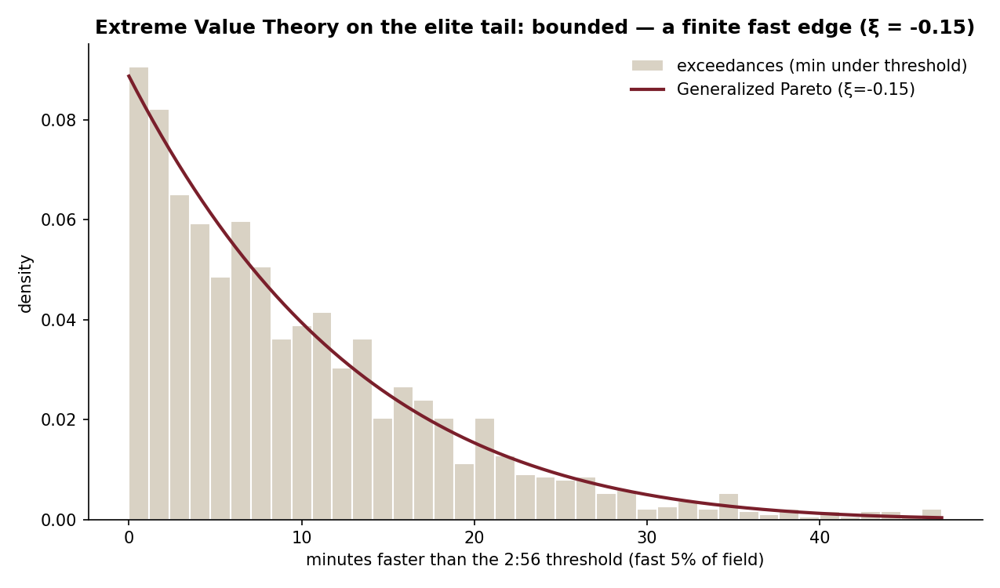
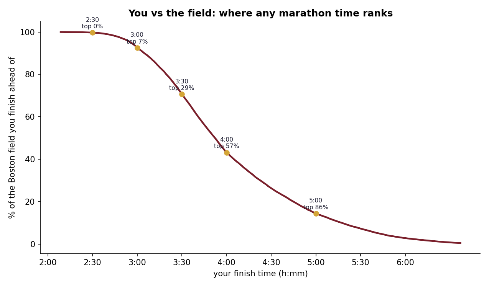

# The Marathon Performance Continuum

*From the back of the pack to the world record — one distribution, and where the GOAT lands on it.*

## One picture of human ability

Everyone who runs a marathon lands somewhere on the same line: a continuum of human
endurance that runs from a six-hour first-timer to the fastest performance ever
recorded. We rarely see the whole line at once. This project draws it — using the
**31,842 finishers of the 2014 Boston Marathon** as the body of the distribution,
and asking exactly where the world record falls on it.

## The shape of a field

  

A marathon field is **log-normal**: a rising shoulder into a peak around **3:30–3:50**,
then a long slow tail out past six hours. The median Boston finisher runs **3:52**;
the mean, dragged right by the slow tail, is **4:03**. Fit the log-normal and it
tracks the histogram closely — a clean, well-behaved distribution of committed
runners.

And then there's the world record. Kelvin Kiptum's **2:00:35** doesn't sit in the
fast end of this distribution — it sits *beyond* it, a gold line to the left of
every one of the 31,842 finishers, faster even than the Boston **winner's 2:09**.
Measured against this field, the record is **2.4 standard deviations below the
mean**, and the *median* runner is **93% slower** than it. The best marathoners on
earth are not the right tail of the amateur distribution; they are their own species
sitting off its edge.

## How far can the edge go?

  

To characterise that edge properly you can't use the body distribution — you need
**Extreme Value Theory**. Taking the fastest 5% of the field as "exceedances" over a
threshold and fitting a **Generalized Pareto** distribution gives a shape parameter
**ξ ≈ −0.15**. The sign is what matters: **ξ < 0 means the tail is bounded** — it has
a finite edge rather than trailing off forever. Human marathon performance runs into
a wall, and the data can see the wall's shadow even if it can't name its exact
location. (It can't: Peaks-Over-Threshold endpoint estimates are famously unstable,
so I don't quote a "fastest possible time" — only the robust fact that the tail is
bounded.)

## Where do *you* land?

  

The practical payoff is a lookup: give it a time, get your place on the continuum. A
**3:00** marathon — a serious amateur goal — beats about **93%** of this already-fast
field. A **4:00** lands right at the median. A **3:30** clears **70%**. And each of
those is still 50–75% slower than the world record. It's a humbling, clarifying way
to read your own result: genuinely good, and still a different universe from the
line's leading edge.

## The honest asterisk

Boston is a *qualifying* race, so this is the distribution of runners who were
already fast enough to get in — not the general public. Every number here is a
statement about *this* field, and I've kept it that way. Put a mass-participation
field under the same lens and the whole curve shifts slower, pushing the world
record even further into a league of its own.

*Code: [github.com/lyhjeremy/marathon-performance-continuum](https://github.com/lyhjeremy/marathon-performance-continuum)*
